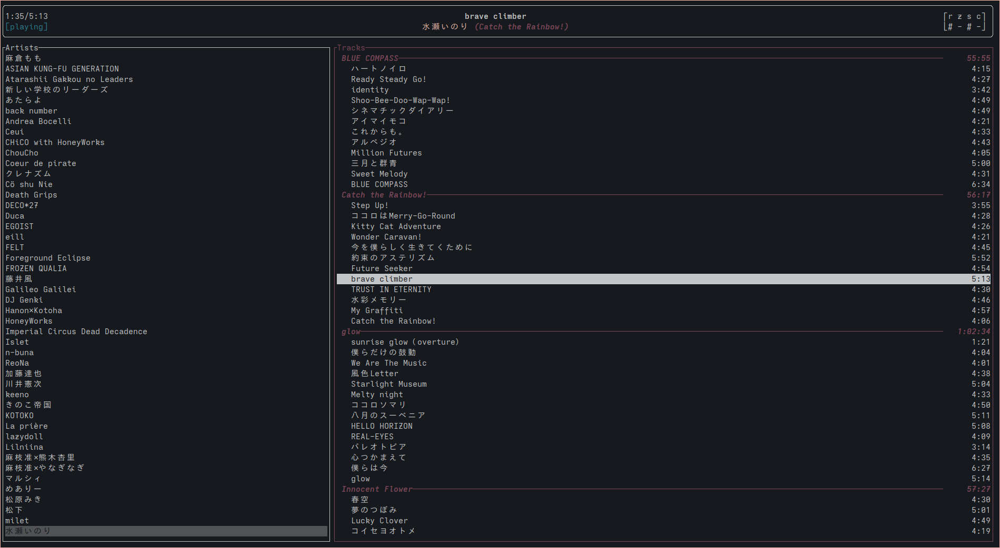
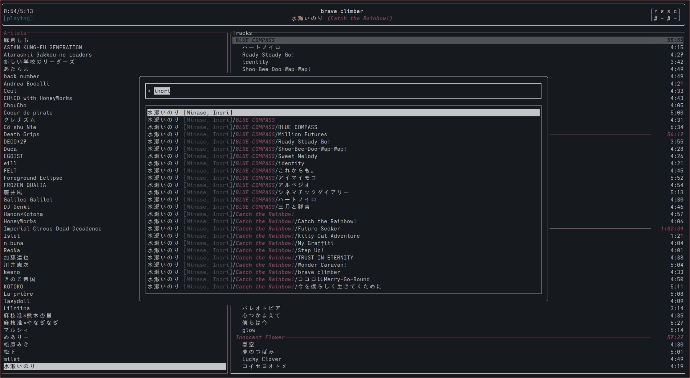
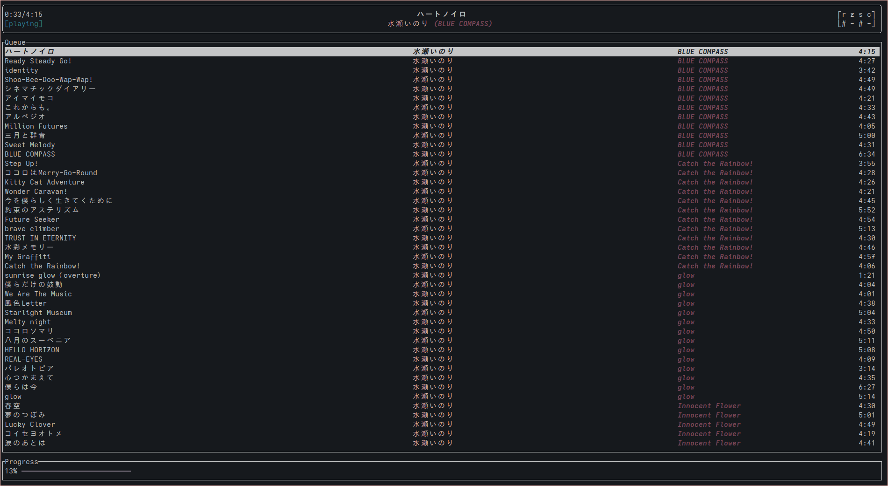

# inori

Client for the Music Player Daemon ([MPD](https://www.musicpd.org/))

## Features

- Fuzzy search everywhere with
  [nucleo](https://github.com/helix-editor/nucleo)
  - Fully unicode aware, with special attention to the "albumartistsort"
    field
  - Global search across all tracks, albums, and artists
- Folding library interface inspired by [cmus](https://cmus.github.io/)
- Queue viewer and manipulation interface
- Configurable, chainable keybindings

## Usage/Installation

Run `cargo install inori`. inori is published on [crates.io](https://crates.io/crates/inori).

The default keybindings use dvorak-convenient movement keys (`dhtn`).
Build/install with the command line args
`--features qwerty_movement_keys --no-default-features` for qwerty-vim
style movement.

inori is also available on the AUR as [inori](https://aur.archlinux.org/packages/inori).
The PKGBUILD includes an option to switch between qwerty and dvorak defaults.

See [configuration.md](./CONFIGURATION.md) for config options, as well
as a full list of all default keybindings.

## Screenshots

 

## Todo
- [ ] Playlist interface
- [ ] Compile feature flag for Japanese album/track title romanization for search using a tokenizer & dictionary
- [ ] More thorough customization options, especially for behavior & layout tweaks
- [ ] Spectrum visualizer like ncmpcpp

## Acknowledgements

- authors of [ratatui](https://ratatui.rs/) and
  [rust-mpd](https://docs.rs/mpd/latest/mpd/)
- [mmtc](https://github.com/figsoda/mmtc) and
  [rmptui](https://github.com/krolyxon/rmptui), two other rust mpd
  clients, helped me learn rust
- [@stephen-huan](https://github.com/stephen-huan): here from day one
