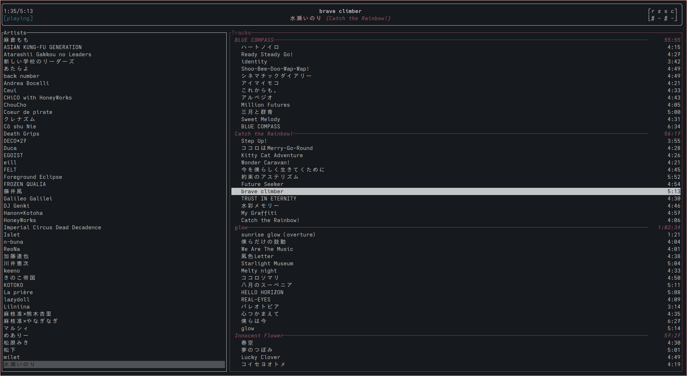
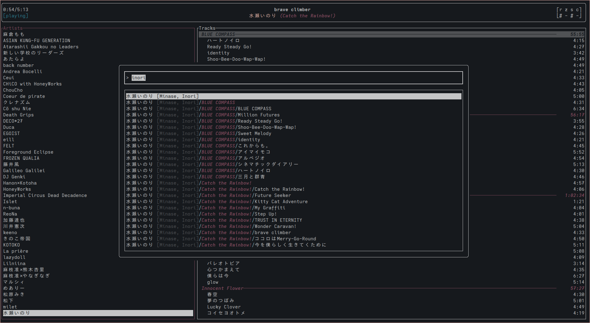
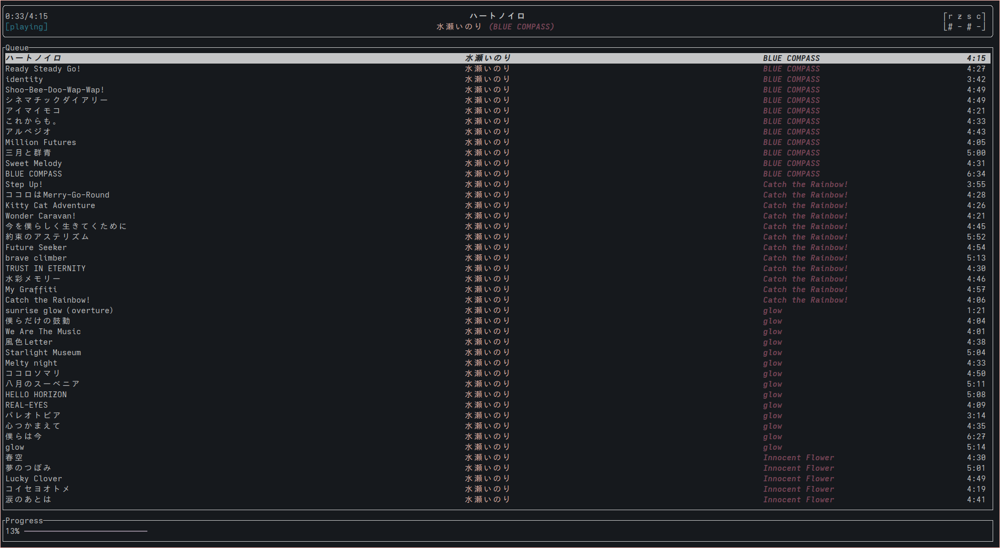

# inori

  
    <picture>
      <source
        media="(prefers-color-scheme: light)"
        srcset="https://github.com/eshrh/inori/raw/HEAD/images/inori-logo.svg"
      />
      <source
        media="(prefers-color-scheme: dark)"
        srcset="https://github.com/eshrh/inori/raw/HEAD/images/inori-logo-white.svg"
      />
      
    </picture>
  

Client for the Music Player Daemon ([MPD](https://www.musicpd.org/)).

## Features

- Fuzzy search everywhere with
  [nucleo](https://github.com/helix-editor/nucleo)
  - Fully unicode aware, with special attention to the "albumartistsort"
    field
  - Global search across all tracks, albums, and artists
  - Fast navigation of non-roman libraries with client-side
    aliases for song & album titles.
- Folding library interface inspired by [cmus](https://cmus.github.io/)
- Queue viewer and manipulation interface
- Configurable, chainable keybindings

## Installation & Usage

Inori is on [crates.io](https://crates.io/crates/inori): `cargo install inori`.

Inori is also available on:

- AUR as [inori](https://aur.archlinux.org/packages/inori)
  [maintainer: [@eshrh](https://aur.archlinux.org/account/esrh)]
- Nixpkgs as [inori](https://github.com/NixOS/nixpkgs/blob/nixos-unstable/pkgs/by-name/in/inori/package.nix)
  [maintainers: [@stephen-huan](https://github.com/stephen-huan), [@eshrh](https://github.com/eshrh)]
  - home-manager module [`programs.inori`](https://github.com/nix-community/home-manager/blob/master/modules/programs/inori.nix)
    [maintainers: [@miku4k](https://github.com/miku4k), [@stephen-huan](https://github.com/stephen-huan)]

See [configuration.md](./CONFIGURATION.md) for config options, as well
as a full list of all default keybindings.

## Screenshots

## Acknowledgements

- authors of [ratatui](https://ratatui.rs/) and
  [rust-mpd](https://docs.rs/mpd/latest/mpd/), base for [inori-mpd](https://github.com/eshrh/inori-mpd) fork
- [mmtc](https://github.com/figsoda/mmtc) and
  [rmptui](https://github.com/krolyxon/rmptui), two earlier rust mpd clients
- [@stephen-huan](https://github.com/stephen-huan): design contribution & nix tooling
